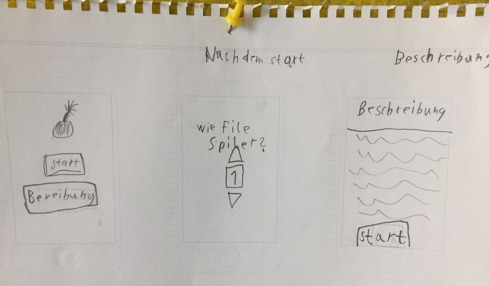
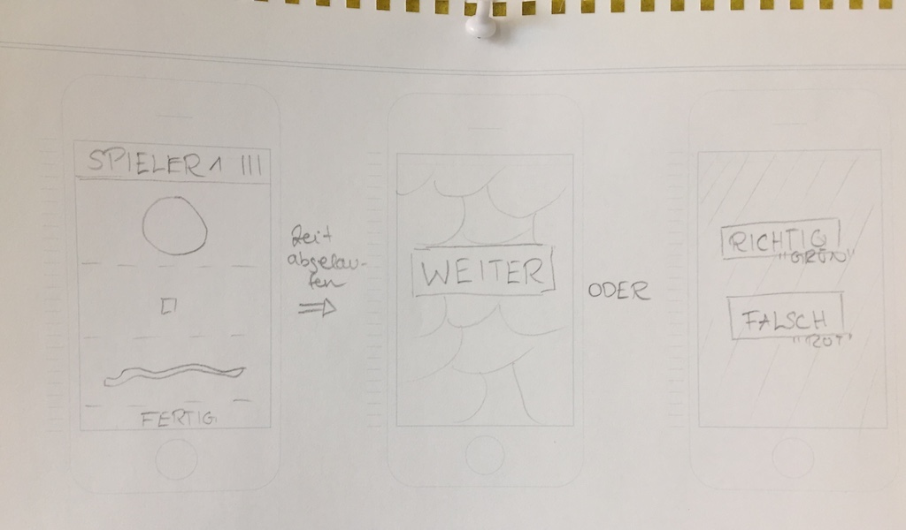
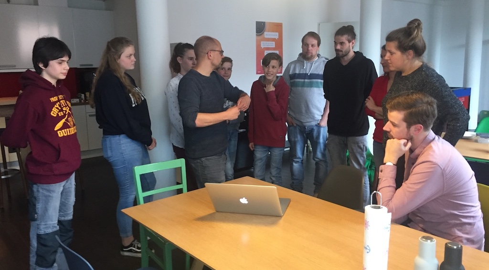

# WANTED!

Ein Spiel von Mia, Paula, Viktor, Justus und Erik, das im Rahmen des Girls' und Boys' Day 2018 entstanden ist.

> In dem Spiel geht es darum, so schnell wie möglich drei verschiedenfarbige Gegenstände zu finden. Die Gegenstände haben jeweils verschieden Formen, zum Beispiel rund, eckig oder wabbelig. Die Gegenstände müssen im Raum gefunden, aber nicht unbedingt hergebracht werden.

## Konzept

## Umsetzung

Das Spiel ist in vanilla JavaScript umgesetzt (ES5) und läuft auch auf älteren Geräten.

Fügt man das Spiel zum Homescreen hinzu, kann man es im Fullscreen-Modus und sogar offline verwenden.

Die verwendeten Sounds stammen von http://www.orangefreesounds.com/.

## Ausprobieren

Hier könnt ihr das Spiel selber ausprobieren:
https://cellular.github.io/zukunftstag-2018/
